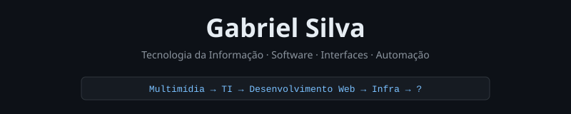

  

  
  
  
  

---

## About

I'm studying Information Technology at UNIVESP while deepening my knowledge in software development, automation, and infrastructure.

Before IT, I spent years studying multimedia and design — which shaped how I approach projects today: I think about both the technical side and the experience of whoever will use it.

I have a particular interest in well-crafted interfaces, applications with their own back-end, automation, and software that looks polished and native.

> Good technology also needs to be well presented.

---

## Technologies & Tools

  

---

## Projects

| Project | Description |
|---|---|
| [**Força Aliada Manager**](https://github.com/ogabriels2/forca-aliada-releases) | Desktop application for server management, automation and monitoring. Interface inspired by native Windows software. |
| [**Força Aliada Site**](https://github.com/ogabriels2/forca-aliada-site) | Institutional website with authentication, control panel and custom back-end. HTML, JavaScript and Node.js. |
| [**Portfolio**](https://github.com/ogabriels2/portfolio) | Personal project for visual experimentation, interfaces and idea organization. |

---

  <a href="https://ogabriels.com">ogabriels.com</a> · São Paulo, Brazil · <a href="README.pt.md">Leia em Português</a>

